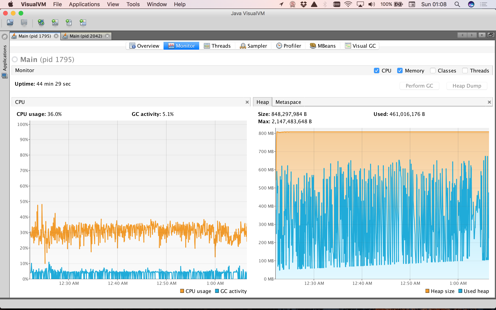
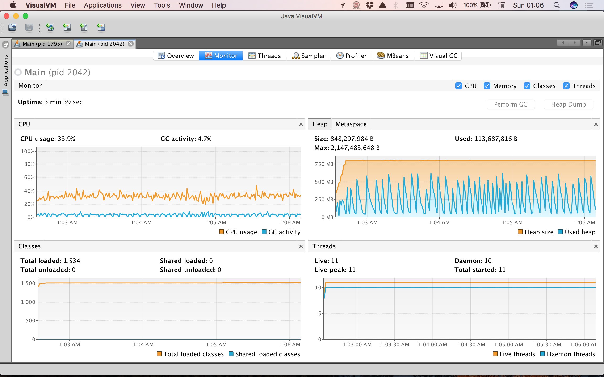
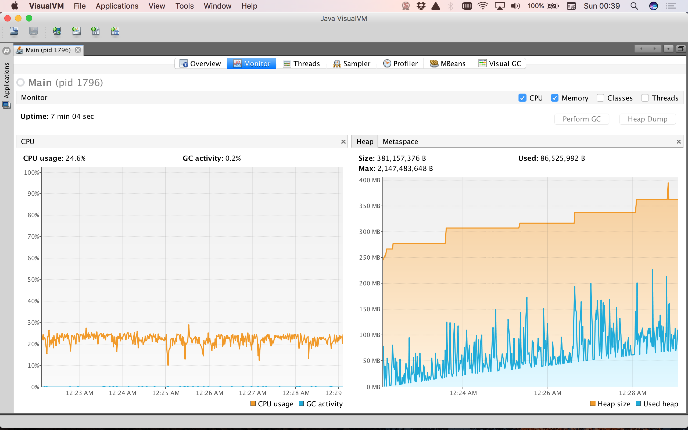
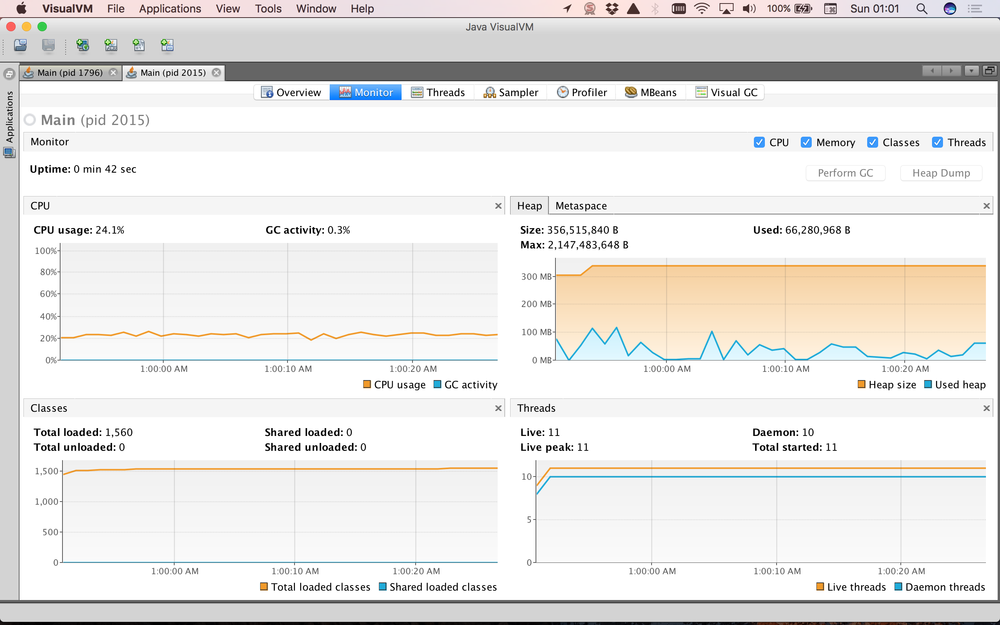

# cglib-test

Benchmarking cglib proxy creation, versions 2.1_3 and 3.2.4.

### Environment

MacBook Pro 
2,8 GHz Intel Core i7
8 GB 1600 MHz DDR3

Jdk1.8.0_05

### Code

```java
int numberOfInstances = 1000000000;

for (int i = 0; i < numberOfInstances; i++)
{
    Enhancer enhancer = new Enhancer();
    enhancer.setSuperclass(SampleImpl.class);
    enhancer.setCallback(new FixedValue()
    {
        public Object loadObject() throws Exception
        {
            return "Hello cglib!";
        }
    });
    SampleImpl proxy = (SampleImpl) enhancer.create();
    proxy = null;
}
```

### Results

| Version       | Time          | Number of Objects  |
| ------------- |--------------:|-------------------:|
| 2.1_3         | 44 min 29 sec.| 1.000.000.000      |
| 3.2.4         |  7 min  4 sec.| 1.000.000.000      |
| 2.1_3         |  3 min 39 sec.|   100.000.000      |
| 3.2.4         |        42 sec.|   100.000.000      |

Samle 2.1_3 - 1.000.000.000 objects



Samle 2.1_3 - 100.000.000 objects



Samle 3.2.4 - 1.000.000.000 objects



Samle 3.2.4 - 100.000.000 objects




